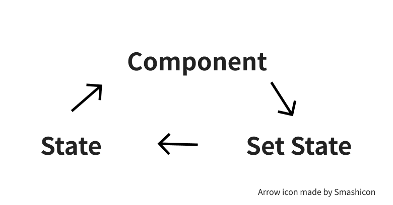

# Handling forms in React ✏️

## Buen día para ti 👋🏼

Posiblemente estés aprendiendo React, o quieres ampliar tu conocimiento en el ecosistema de esta librería de Javascript. El día de hoy vengo a enseñarte algunas maneras de manejar formularios.

El uso de formularios en desarrollo web es fundamental a la hora de habilitar la interactividad de los usuarios con el objetivo de almacenar, validar y enviar información que, puede ser util en el futuro para los usuarios o la aplicación en cuestión.

Lo cierto es que implementar formularios no es tan sencillo como creeríamos, a la hora de crear un formulario, diferentes aspectos deben ser considerados en cuenta:

- Accesibilidad: Miles de usuarios en el mundo sufren algún tipo de discapacidad y navegan a través de herramientas diferentes al mouse, por lo tanto, la semántica del formulario y las estrategias de validación requieren un nivel de esfuerzo importante a la hora de ser implementados.

- Validación: Cada campo que existe en el formulario tiene unas reglas particulares, algunos son opcionales, algunos obligatorios, algunos solo permiten ingresar correos electrónicos, requieren valores mínimos o máximos, es por ello que las validaciones cubren un papel importante a la hora de guiar adecuadamente a todos los usuarios (con o sin discapacidades) si un campo no cumple las reglas.

- Serialización: Cuando un usuario termina de diligenciar el formulario, toda su información se encuentra en algún espacio de memoria en el contexto de tu aplicación, obtener esa información y enviarla adecuadamente en ocasiones puede ser un reto.


Por estas y mas razones te propongo que exploremos algunos conceptos importantes para la creación de formularios en React.

## Tabla de contenidos

1. Dos formas de construir formularios en React\
  1.1 Componentes Controlados\
  1.2 Componentes No Controlados
2. Validaciones\
  2.1 Validaciones Síncronas\
  2.2 Validaciones Asíncronas\
3. Ecosistema de Formularios en React\
  3.1 Formik\
  3.2 React Hook Form

<br/>
<br/>

## Dos formas de construir formularios en React

### Componentes Controlados

Un componente controlado es aquel que usa los cambios de estado o cambios de props como fuente de verdad para representarse en el DOM. De manera mas concreta, es un componente que sincroniza su valor con el estado y cada que cambia vuelve y se sincroniza, puedes pensar en el como un proceso cíclico.



Llevado a un componente de React, se vería de esta manera:

```jsx
import * as React from 'react';

function Input () {
  const [content, setContent] = React.useState('');

  function handleChange (evt) {
    const { target } = evt;
    const { value } = target;
    setContent(value);
  }

  return <input value={content} onChange={handleChange} />
}
```

Si lo analizamos un poco mas, nos daremos cuenta de que:

1. Es un componente stateful.
2. El elemento recibe una propiedad value que proviene del estado.
3. Cada que presionamos una tecla dentro del campo (`onChange`), el método `handleChange` modifica el estado, por lo tanto cada tecla que se presiona hace parte del nuevo estado.
4. Como el estado cambia, el nuevo valor de `<input>` cambia.

Los componentes controlados son bastante populares cuando de formularios se trata, generalmente el cambio de estado se controla un nivel mas arriba ya que regularmente tenemos mas de un `<input>`.


```jsx
  import * as React from 'react';

  function Form () {
    const [values, setValues] = React.useState({
      name: '',
      lastName: '',
      email: '',
      password: '',
      confirmPassword: ''
    })

    function handleChange (evt) {
      const { target } = evt;
      // name contiene el input exacto que desencadenó el evento
      const { name, value } = target;

      // Este snippet: 
      // 1. Clona el estado actual
      // 2. Remplaza el valor del input que se desencadenó
      const newValues = {
        ...values,
        [name]: value
      }

      // Sincroniza el estado de nuevo
      setValues(newValues);
    }

    return (
      <form>
        <Input
          name='name'
          value={values.name}
          onChange={handleChange}
        />
        <Input
          name='lastName'
          value={values.lastName}
          onChange={handleChange}
        />
        <Input
          name='email'
          value={values.email}
          onChange={handleChange}
        />
        <Input
          name='password'
          value={values.password}
          onChange={handleChange}
        />
        <Input
          name='confirmPassword'
          value={values.confirmPassword}
          onChange={handleChange} 
        />
      </form>
    )
  }
```

Finalmente el componente `<Input>` solo tiene la responsabilidad de asignar los `props` y sincronizarse con el componente `<Form>` en cada tecla que se presiona sobre alguno de los campos.

```jsx
import * as React from 'react';

function Input (props) {
  const { name, value, onChange } = props;
  return <input name={name} value={value} onChange={onChange} />
}
````